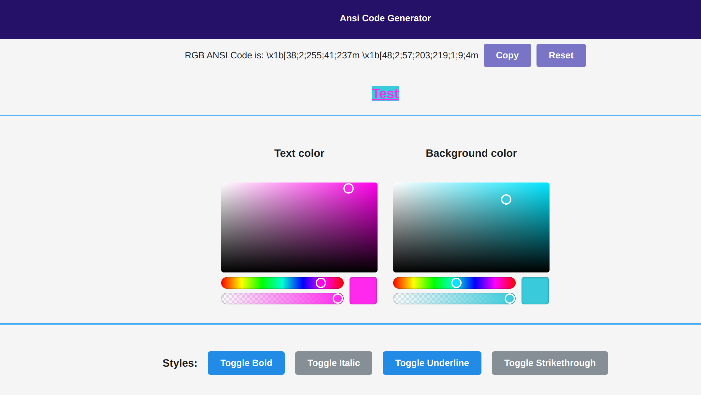
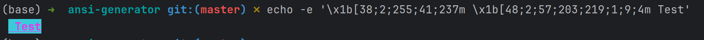

# Ansi Code Generator

Welcome to the ANSI Code Generator! 
This intuitive tool allows you to easily create and customize ANSI escape codes for text formatting. 
Users can interactively select text colors, background colors, and apply various text styles like bold,
italic, underline, and strikethrough. 
The interface provides a live preview of the text appearance, making adjustments straightforward and immediate.

## Features
- **Interactive Color Selection:** Choose precise **RGB** colors for text and background.
- **Flexible Text Styling:** Apply styles such as bold, italic, underline, and strikethrough to your text.
- **Real-Time Preview:** Immediately see the effects of your styling choices.
- **Efficient Code Generation:** Automatically generate the necessary ANSI escape codes based on your customizations.
- **Clipboard Integration:** Copy the generated codes with a single click, ready for integration into your projects.

## Usage
Adjust the color and style settings using the provided interface. As you make changes, the ANSI escape code will update in real time. 
Click the "Copy" button to transfer the code to your clipboard.


## Example 
Here is how you might generate ANSI code for magenta text on a teal background, underlined:
```
echo -e '\x1b[38;2;255;41;237m \x1b[48;2;57;203;219;1;9;4m Test'
```







